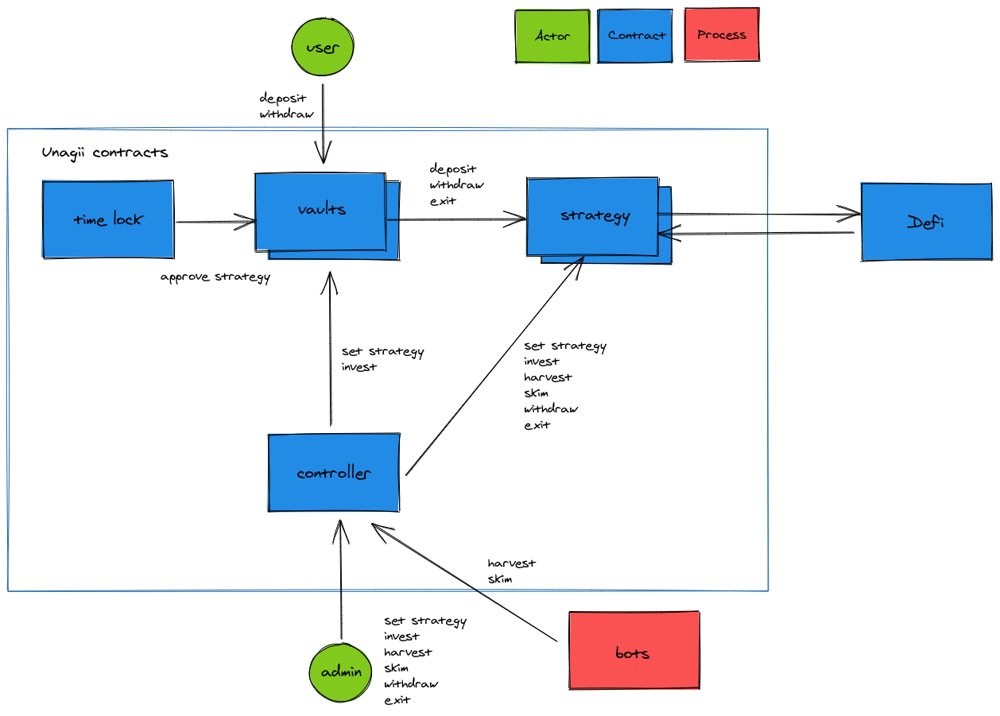

# Unagii Vault

### Contract Design Goals

- Safety > Gas cost > ROI
- permissionless deposit / withdraw

### Contract Architecture



### Install

```shell
npm i
npm run compile
npm run types
```

### Test

```shell
cp .env.sample .env

# start ganache (used to speed up test, truffle test without ganache is slow)
npx ganache-cli

# unit test
npm run test:unit
# integration test
npm run test:integration

# test mainnet fork
source .env

npx ganache-cli \
-e 10000 \
--fork https://mainnet.infura.io/v3/$INFURA_API_KEY \
--unlock $DAI_WHALE \
--unlock $USDC_WHALE \
--unlock $USDT_WHALE \
--unlock $BUSD_WHALE \
--unlock $GUSD_WHALE \
--unlock $USDP_WHALE \
--unlock $WBTC_WHALE \
--unlock $EURS_WHALE \
--networkId 999

# NOTE
# restart ganache when you see this error
# Error: Returned error: Returned error: project ID does not have access to archive state

# test specific file
npx truffle test --network mainnet_fork test/mainnet/path/to/test.ts
# test all (need to restart truffle after each test)
find test/mainnet -name "test-*.ts" -exec truffle test --network mainnet_fork {} \;
```

### Lint

```shell
npm run solhint
npm run lint
```

### Slither

```shell
docker run -it --rm -v $PWD:/code trailofbits/eth-security-toolbox

solc-select 0.6.11
cd /code
# slither analysis
slither --exclude-dependencies .

# quick review
slither . --print human-summary

slither . --print inheritance-graph
xdot contracts.dot

slither . --print contract-summary

# in-depth review
slither . --print call-graph
slither . --print cfg
slither . --print function-summary
slither . --print vars-and-auth

# save warnings / erros to ignore
slither . --triage

# reset Slither
rm slither.db.json
```

### Deploy

```shell
npm run clean
npx hardhat compile
env $(cat .env) npx hardhat deploy:strategy --network mainnet --strategy StrategyGusdDai --dev true
```

##### Deploy Vault

1. Deploy `Vault` with `timeLock` set to `admin`
2. Deploy `StrategyNoOp`
3. `Vault.approveStrategy(address of StrategyNoOp)`
4. Deploy, approve and set any other strategy
5. `Vault.setTimelock(address of timeLock contract)`
6. `Vault.setAdmin(address of multi sig)`

##### Deployed Contracts

See [scripts/config.ts](./scripts/config.ts)

##### Verify Contract on Etherscan

```shell
# Warning: Temporary delete any unnecessary contracts and clear the artifacts and build
# otherwise these will also be part of the verified contract.
env $(cat .env) npx hardhat verify --network mainnet DEPLOYED_CONTRACT_ADDRESS CONSTRUCTOR_ARG_1 CONSTRUCTOR_ARG_2 ...
```

##### Flatten Contracts

```shell
npm run flat -- contracts/Contract.sol > flat.sol
```

##### Get Contract Size

```shell
cat build/contracts/Contract.json | jq -r '.deployedBytecode' | wc -c
# divide output by 2 to get size in bytes
```

##### Archived Contracts

[./archive](./archive)
