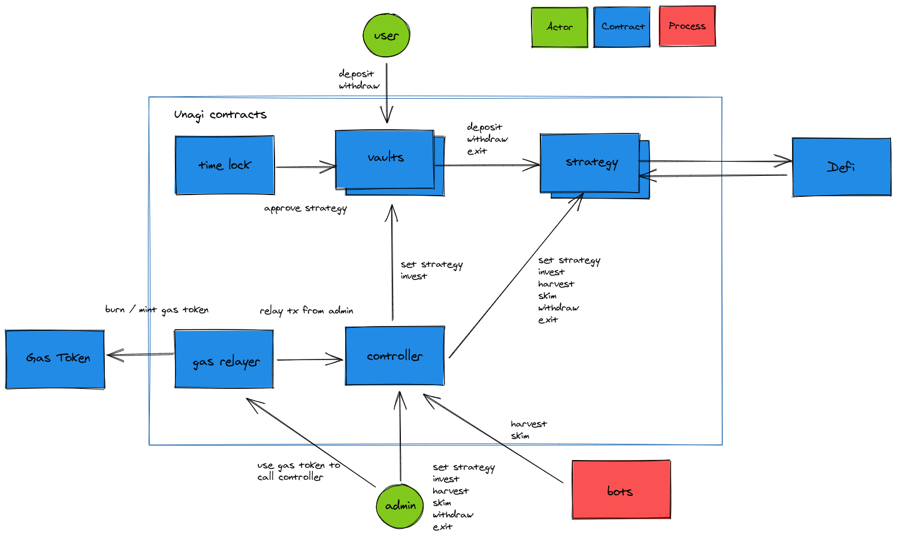

# Unagi Vault

### Contract Design Goals

- Safety > Gas cost > ROI
- permissionless deposit / withdraw

### Contract Architecture



### Install

```shell
npm i
npm run compile
```

### Test

```shell
cp .env.sample .env.test
# unit test
npm run test:unit

# test mainnet fork
source .env.test

ganache-cli \
--fork https://mainnet.infura.io/v3/$INFURA_API_KEY \
--unlock $STABLE_COIN_HOLDER \
--unlock $DAI_WHALE \
--unlock $USDC_WHALE \
--unlock $CHI_WHALE \
--networkId 999

npm run test:mainnet

# NOTE
# restart ganache when you see this error
# Error: Returned error: Returned error: project ID does not have access to archive state

# test specific file
truffle test --network mainnet_fork test/mainnet/path/to/test.js
```

### Lint

```shell
npm run ethlint
npm run lint
```

### Slither

```shell
docker run -it -v $PWD:/code trailofbits/eth-security-toolbox

solc-select 0.5.17
cd /code
# slither analysis
slither .

# quick review
slither . --print human-summary

slither . --print inheritance-graph
xdot contracts.dot

slither . --print contract-summary

# in-depth review
slither . --print call-graph
slither . --print cfg
slither . --print function-summary
slither . --print vars-and-auth
```

### Deploy

```shell
# deploy ERC20 token (used for testing)
env $(cat .env.test) npx buidler run scripts/deploy-ropsten-erc20.js --network ropsten

# deploy GasRelayer
env $(cat .env.test) npx buidler run scripts/deploy-gas-relayer.js --network ropsten
# deploy Controller
env $(cat .env.test) npx buidler run scripts/deploy-controller.js --network ropsten
# deploy Vault
env $(cat .env.test) npx buidler run scripts/deploy-ropsten-vault.js --network ropsten
# deploy StrategyTest
nv $(cat .env.test) npx buidler run scripts/deploy-ropsten-strategy-test.js --network ropsten
```

##### Ropsten

`ERC20` 0x8D760CAbe956332e6021990FCCE40CBDDd5d7890

`GasRelayer` 0xD01D18440A150581A36581adD5b2bcb2DCc63333

`Controller` 0xB1fA981B43EC0D5B2C6537DBcfFc7599613d7d39

`Vault` 0x8496d69D51dF633a851B0CE96b33974BDfeAff73

`StrategyTest` 0x042a9f1537d809255682B749E9F2Db6FD24505cA

### APY

```
Ai = total value of assets locked in vault + strategy at time i
Si = total amount of shares at time i

Ai / Si = amount of assets you can claim per share

APY = (An / Sn) / (A0 / S0) - 1
where n = 12

dAi = change in value of assets from time i to i + 1
A_(i+1) = Ai + dAi

# Things that change dAi
+ deposit
- withdraw
+ harvest
+/- assets locked in other Defi to yield fees and interest
+/- price of LP tokens
```
